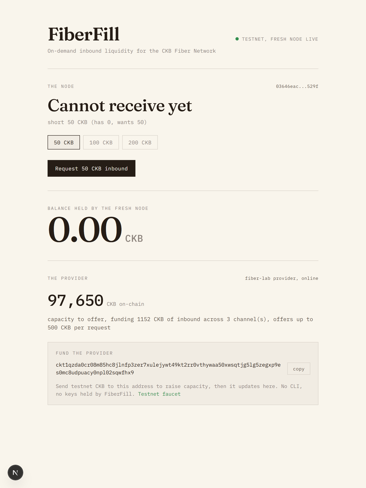
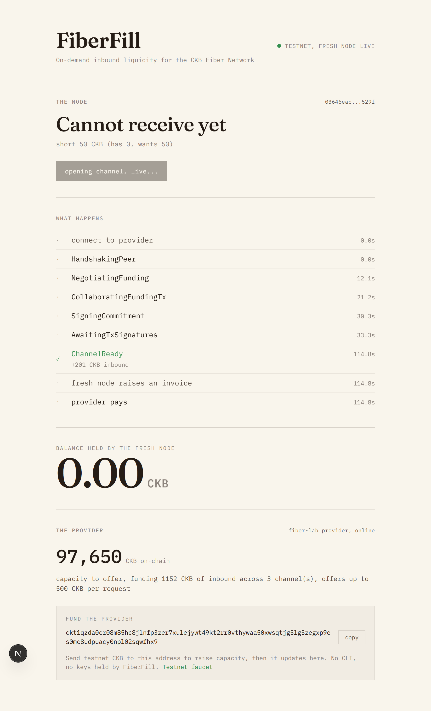
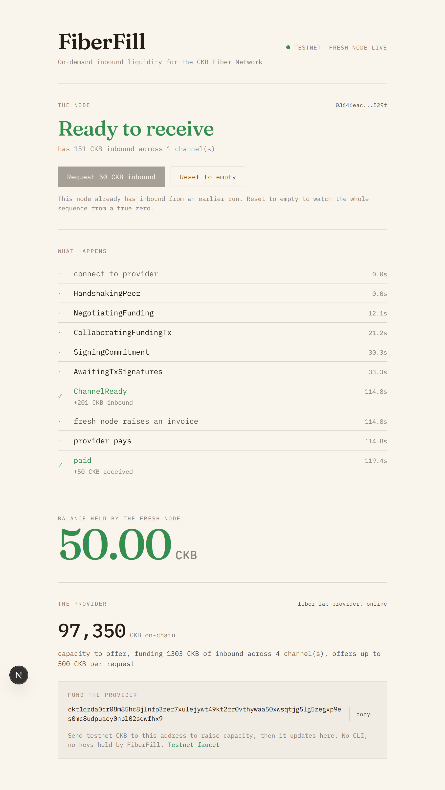

# Week 13 - FiberFill goes public: the money-shot packaged for a judge

**Name:** David Uhumagho
**Week Ending:** 2026-07-18
**Project:** FiberFill (Fiber inbound-liquidity / LSP toolkit) - "Gone in 60ms" Fiber hackathon, Category 3

---

## Current Progress

- Pushed FiberFill public to GitHub (`David-Pjs/fiberfill`, MIT), so the toolkit that was local-only last week is now the actual submission artifact
- Made cold-start channel open reliable and wrote the demo runbook: a fresh peer link now opens cleanly instead of stalling, and `DEMO.md` documents the warm-up step and the real timings so the live run is repeatable, not lucky
- Built the judge-first CLI: `npm run demo` runs the whole empty-to-paid money-shot against live nodes in one command, and `npm run demo -- 200` lets a judge pick the amount (50/100/200) on the spot
- Taught the hardening harness to self-reset, so a judge-selectable amount can be run repeatedly without hand-resetting the target node back to zero inbound between runs
- Captured the live money-shot from a cold run on 15 July (ChannelReady at 114.8s, payment landed at 119.4s, real observed timings) with a scripted browser capture, and led the README with those three screenshots
- Wrote the submission docs: README, the technical breakdown, and the gap writeup that positions FiberFill against Fiber issue #1255
- Recorded the demo video against the runbook: problem, the live empty-to-paid money-shot, and one line on impact

## Screenshots

## Key Learnings

- The demo is only honest if the timings are the real ones. The cold path to `ChannelReady` runs about 150s; a warm peer link cuts it to 60-90s. Rather than fake a fast run, the runbook does one warm-up open-and-reset before recording so the link is warm, and the README reports the observed 114.8s / 119.4s rather than a target
- Reducing the whole proof to `npm run demo` changed what a judge has to trust. Instead of following a multi-step runbook, they run one command against two real testnet nodes and watch empty go to paid, which removes the surface where a live demo usually breaks
- Self-reset had to live in the harness, not in my hands. Once a judge can pick 50, 100, or 200 and rerun, any step that needs me to manually close channels and drain the node back to zero is a step that fails under pressure, so the reset became part of the run
- The strongest framing for the writeup was the carve-out, not the feature list. Fiber's own #1255 places liquidity provisioning and inbound channel funding explicitly out of scope and tells agent builders to avoid it, so FiberFill reads as the layer that composes with the agent protocol rather than one more thing competing with it

## Pending

- The fast demo still depends on a warm peer link; the cold path works but is slow enough that an unwarmed live run would drag

---

## The week in one line

FiberFill went from a proven-but-private engine to a public submission a judge can run in one command: the repo is live, the money-shot is captured from a real cold run and recorded on video, and the docs make the argument for why this lane was open to take.

## What actually shipped

Last week closed the technical risk: the engine drove a fresh node from unable-to-receive to paid on live testnet, and the dashboard showed it. This week was packaging, and packaging turned out to have its own risk, which was the live demo itself. A demo that only works if I babysit it is not a demo a judge trusts. So the work was making the proof survive contact with someone who did not build it: one command (`npm run demo`), a judge-chosen amount, a harness that resets itself between runs, and a runbook that warms the peer link so the on-screen open takes the fast path instead of the cold 150 seconds. The screenshots in the README are from an actual cold run on 15 July, the timings under them are what was observed, and the video walks through that same run rather than a staged one.

## Where this leaves the project

The repo is public, the toolkit runs empty-to-paid in one command, the video is recorded, and the docs land the gap: a fresh Fiber node structurally cannot receive, the reserve does not fix it, and #1255 explicitly leaves the inbound-liquidity lane open. The build is done and it proves itself on demand; the case for it is now made, not just true.
